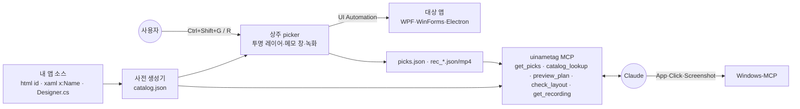
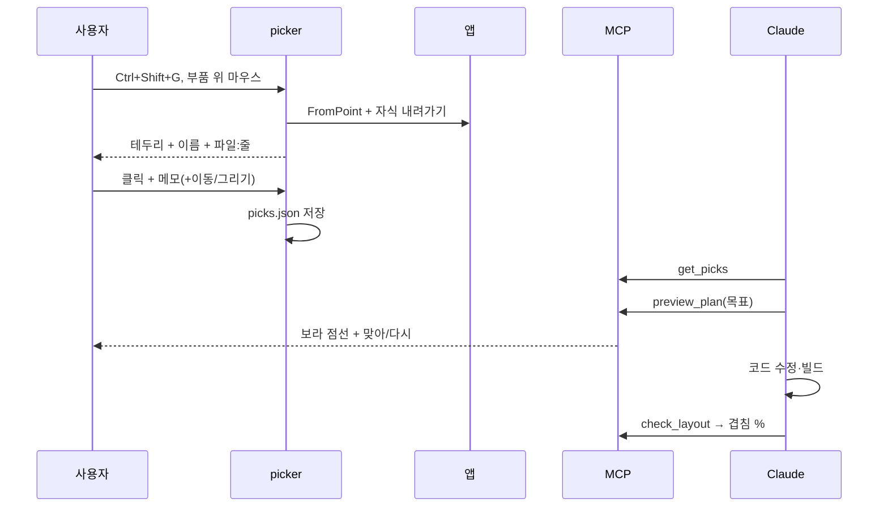
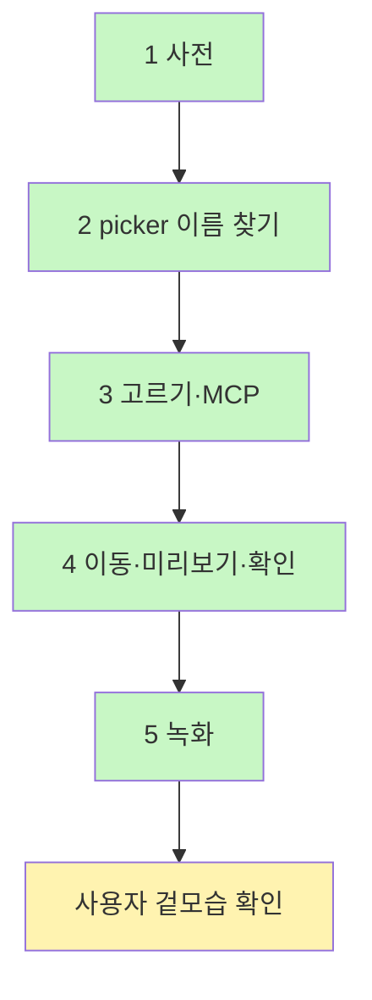
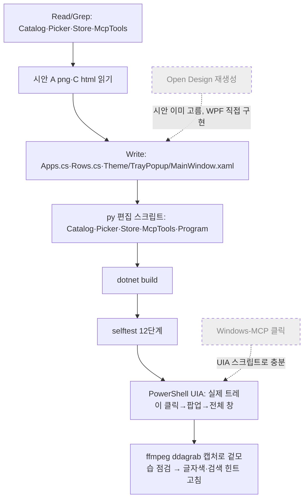

# ARCHITECTURE

```mermaid
flowchart LR
  소스[내 앱 소스<br/>html id · xaml x:Name · Designer.cs] --> 사전[사전 생성기<br/>catalog.json]
  사용자((사용자)) -->|Ctrl+Shift+G / R| 피커[상주 picker<br/>투명 레이어·메모 창·녹화]
  피커 -->|UI Automation| 앱[대상 앱<br/>WPF·WinForms·Electron]
  사전 --> 피커
  피커 --> 대기열[picks.json · rec_*.json/mp4]
  대기열 --> MCP[uinametag MCP<br/>get_picks · catalog_lookup · preview_plan · check_layout · get_recording]
  사전 --> MCP
  MCP <--> 클로드((Claude))
  클로드 -->|App·Click·Screenshot| WMCP[Windows-MCP]
```

```mermaid
sequenceDiagram
  participant 사용자
  participant picker
  participant 앱
  participant MCP
  participant Claude
  사용자->>picker: Ctrl+Shift+G, 부품 위 마우스
  picker->>앱: FromPoint + 자식 내려가기
  picker-->>사용자: 테두리 + 이름 + 파일:줄
  사용자->>picker: 클릭 + 메모(+이동/그리기)
  picker->>picker: picks.json 저장
  Claude->>MCP: get_picks
  Claude->>MCP: preview_plan(목표)
  MCP-->>사용자: 보라 점선 + 맞아/다시
  Claude->>Claude: 코드 수정·빌드
  Claude->>MCP: check_layout → 겹침 %
```

```mermaid
flowchart TD
  A[1 사전]:::done --> B[2 picker 이름 찾기]:::done --> C[3 고르기·MCP]:::done --> D[4 이동·미리보기·확인]:::done --> E[5 녹화]:::done --> F[사용자 겉모습 확인]:::wip
  classDef done fill:#c8f7c5
  classDef wip fill:#fff3b0
```

## 도구 과정 — 메인 창 묶음 (2026-10-20)

```mermaid
flowchart TD
  A[Read/Grep: Catalog·Picker·Store·McpTools] --> B[시안 A png·C html 읽기]
  B --> C[Write: Apps.cs·Rows.cs·Theme/TrayPopup/MainWindow.xaml]
  C --> D[py 편집 스크립트: Catalog·Picker·Store·McpTools·Program]
  D --> E[dotnet build]
  E --> F[selftest 12단계]
  F --> G[PowerShell UIA: 실제 트레이 클릭→팝업→전체 창]
  G --> H[ffmpeg ddagrab 캡처로 겉모습 점검 → 글자색·검색 힌트 고침]
  X[Open Design 재생성]:::no -.->|시안 이미 고름, WPF 직접 구현| C
  Y[Windows-MCP 클릭]:::no -.->|UIA 스크립트로 충분| G
  classDef no stroke-dasharray: 5 5,fill:#eee,color:#888
```
